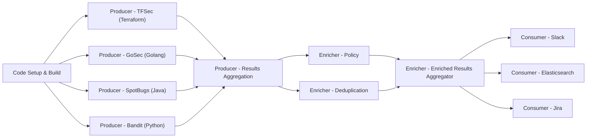

# Smithy (formerly Dracon)

  

  

By [Smithy](https://smithy.security)

Security scanning,results unification and enrichment tool
([ASOC](https://www.gartner.com/reviews/market/application-security-orchestration-and-correlation-asoc-tools))

Security pipelines on Kubernetes. The purpose of this project is to provide a
scalable and flexible framework to execute arbitrary security scanning
tools on code and infrastructure while processing the results in a versatile
way.

## Announcements!!!

We have renamed the team and the project to Smithy. Come join us at our updated [Github repository](https://github.com/smithy-security/smithy) and help us build more awesome stuff!
You can also find us on our [Discord server](https://discord.gg/xzsHxUxK).
